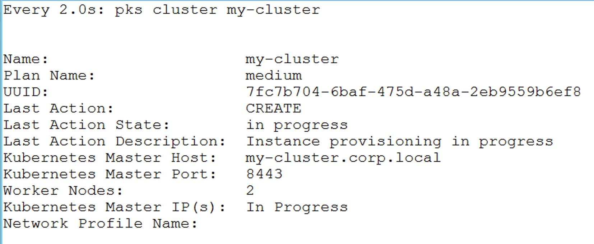

# Helm Installation and Lab

## Introduction

Helm is a package manager for Kubernetes that allows developers and operators to more easily package, configure, and deploy applications and services onto Kubernetes clusters.

## Overview

Most every programming language and operating system has its own package manager to help with the installation and maintenance of software. Helm provides the same basic feature set as many of the package managers you may already be familiar with, such as Debian's apt, or Python's pip.

### Helm capabilities:

- Install software.
- Automatically install software dependencies.
- Upgrade software.
- Configure software deployments.
- Fetch software packages from repositories.

### Prereq's 

- ServiceAccount and ClusterRoleBinding for **Tiller**
- Command line tool `helm` & `kubectl`
- Kubernetes Cluster

1.0 SSH to the cli-vm

Screenshot 1.0

#### Create a K8s cluster

`pks login -a pks.corp.local -u pksadmin -p VMware1! -k`

PKS Login

`pks create-cluster my-cluster -e my-cluster.corp.local -n 2 -p medium`

- **Note:** that it will take *25-30 minutes* to create the cluster

Create Cluster

`watch pks cluster my-cluster`

- Watch the for the **Last Action State: Succeeded**

Watch PKS Create

`pks get-credentials my-cluster`

### Prepare the K8s cluster for Tiller

1.1 Install the `helm` binary on your jumpbox

`curl -O https://storage.googleapis.com/kubernetes-helm/helm-v2.11.0-linux-amd64.tar.gz && tar -zxvf helm-v2.11.0-linux-amd64.tar.gz && mv linux-amd64/helm /usr/local/bin/helm`

Install Helm

1.2 Pull down the Helm Chart lab repo with `git clone`

`git clone https://github.com/nvpnathan/helm-charts.git`

1.3 Navigate into the helm-charts directory

`cd helm-charts/planespotter/tiller`

1.4 Apply the Tiller ServiceAccount and ClusterRoleBinding, along with a default storage class for MySQL to your K8s cluster

`kubectl apply -f rbac-config.yaml`

`kubectl apply -f default-sc.yaml`

Screenshot 1.4

1.5 Navigate to the **helm chart** directory

`cd ../../`

1.6 Install **tiller** into your K8s cluster with the service account created in 1.3

`helm init --service-account tiller`

Screenshot 1.6

1.7 Verify Tiller is running in your **kube-system** namespace

`kubectl get pods -n kube-system | grep tiller`

Screenshot 1.7

1.8 Create the namespace for the Planespotter Helm Chart

`kubectl create ns planespotter`

Screenshot 1.8

1.9 Install the **Planespotter** application with `helm`

`helm install --name planespotter ./planespotter`

1.10 Switch to the **planespotter ns**

- Fix `kubens` (symbolic link is broken)

    - `rm  /usr/local/bin/kubens`

    - `ln -s /opt/kubectx/kubens /usr/local/bin/kubens`

`kubens planespotter`

1.11 Create a **Wildcard DNS record** for the Ingress Controller for the cluster

Screenshot 1.11

1.12 Verify Planespotter is running

`kubectl get pods`

Screenshot 1.12

1.13 Verify you can browse to the Planespotter app in a web browser

`http://planespotter.ing.corp.local`

Screenshot 1.12

